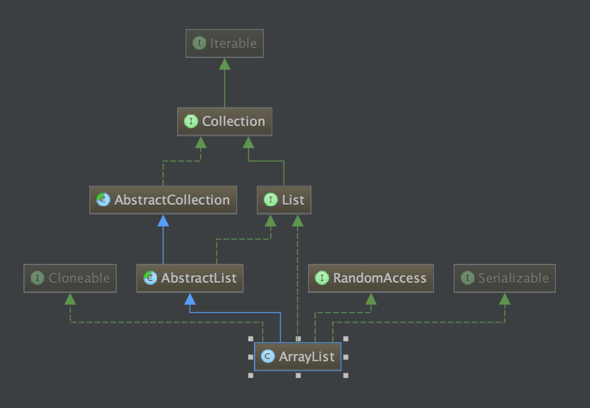

# ArrayList

### 1. 类功能说明
</pre>

ArrayList是一个基于数组实现的自动扩容的非线程安全列表, 其包含该以下三个构造函数:
   1. ArrayList(int initialCapacity) : 
        创建指定初始化大小的列表, elementData是真正存储数据的数组, elementData.length >= size, 也就是说会提前分配一定大小的内存给elementData, 以便于后面每次插入新数据时, 需要重新扩充内存.
        当 initialCapacity < 0 时, 将发生IllegalArgumentException异常.
        当 initialCapacity = 0 时, elementData将赋值为EMPTY_ELEMENTDATA空数组. 
        当 initialCapacity > 0 时, elementData将会创建一个大小为initialCapacity的数组.
        
   2. ArrayList():
        默认构造器, elementData将赋值为DEFAULTCAPACITY_EMPTY_ELEMENTDATA默认空数组.
        
   3. ArrayList(Collection<? extends E> c):
        新生成的列表只会拷贝c集合的数据部分, 也就是说通过这种方式构造完之后, 新生成的list的capacity = c.size() <= c 的 capacity.
        集合中的数据不会深度拷贝, 只是拷贝原来数据的引用, 也就是说改变c里面某个引用元素的某个属性值, 新生成的list中对应对象的属性值也会变化.
        详情见 测试用例(arrayListConstructCollectionTest)
        
            
注: 你可能会问为什么会出现两个空数据EMPTY_ELEMENTDATA 和 DEFAULTCAPACITY_EMPTY_ELEMENTDATA?

因为elementData为DEFAULTCAPACITY_EMPTY_ELEMENTDATA时, 如果往列表中添加数据, 则elementData初始至少会分配DEFAULT_CAPACITY=10个容量,
并且只有使用ArrayList()构造器, 才会以此方式分配内存.

区别:

当使用new ArrayList(0)创建对象, 添加一个数据时, 其分配的 capacity = 1 .

当使用new ArrayList()创建对象, 添加一个数据时, 其分配的 capacity = DEFAULT_CAPACITY = 10 .

详情见 测试用例(arrayListInitialCapacityTest)

</pre>    

### 2. 类UML图

### 3. 时间复杂度以及空间复杂度分析
<pre>

1. 时间复杂度
   3.1.1 
 
</pre>

### 4. 算法分析及关键方法分析

### 5. 适应场景

### 6. 同样功能的类对比 或 不同版本实现对比

### 7. 是否有优化方案? 方案的实现.

### 8. 基本测试用例