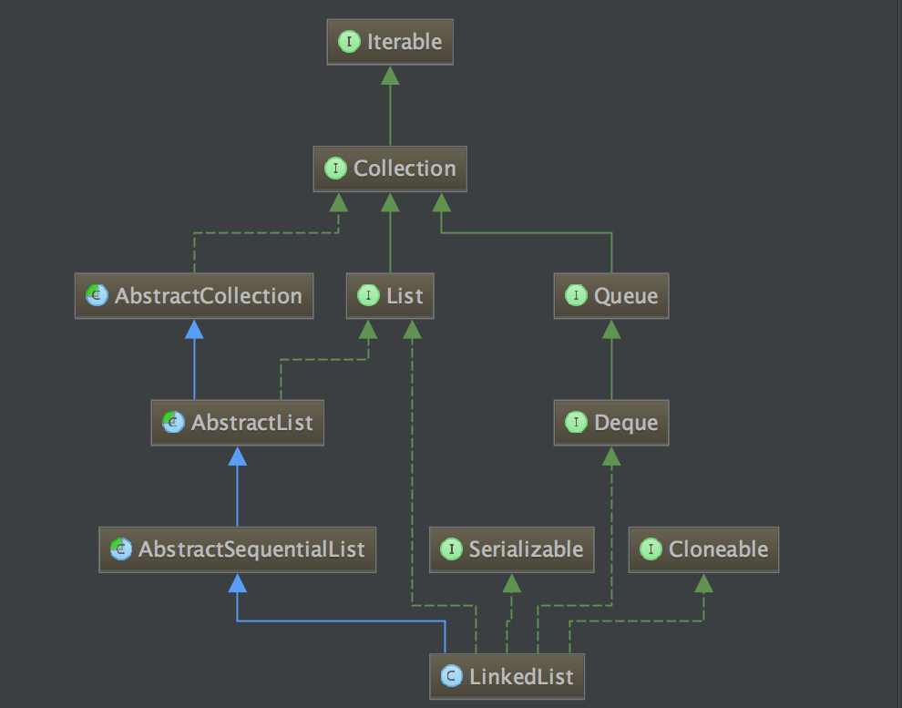

# LinkedList

### 1. 类功能说明
<pre>
    LinkedList既是一个基于链表实现的非线程安全的列表，也是一个实现于Deque的双端队列,
其构造方法有如下几个:
<pre>
1. LinkedList():
	默认构造器，什么都没做。
</pre>
<pre>
2. LinkedList(Collection&lt? extends E&gt c):
	该构造函数会调用c.toArray(), 然后将c中的元素循环添加到链表中，
和ArrayList一样，对集合中的元素本身是浅拷贝。
</pre>
</pre>

### 2. 类UML图


### 3. 时间复杂度以及空间复杂度分析
<pre>

3.1. 时间复杂度
	3.1.1 getFirst(),getLast(),removeFirst(),removeLast(),addFirst(E e),addLast(E e) 和
Queue ， Deque的一些操作，时间复杂度为O(1). 因为LinkedList是一个基于链表实现的，所以对链表的头和尾
进行删除，修改，查询时，能够直接定位。
	3.1.2 indexOf(Object o),lastIndexOf(Object o),remove(int index),
E set(int index, E element),E get(int index)等操作的时间复杂度为O(n).
由于LinkedList是一个基于链表实现的，所以需要通过下标定位元素的话，需要循环遍历。

3.2. 空间复杂度
	3.2.2 LinkedList的空间复杂度为O(n), 每增加一个元素，都会创建一个新的Node节点，每个Node节点有三个属
性item， next，prev。
</pre>

### 4. 算法分析及关键方法分析
#### 4.1 算法分析
<pre>
	LinkedList是一个基于链表实现的非线程安全的列表和双端队列，LinkedList持有first，head两个头尾节点，
每一个节点是一个内部类Node实例, 其包括数据部分item，前一个节点引用prev，后一个节点引用next。因此使用
LinkedList下标查找元素需要遍历链表，但往头部和尾部添加或删除数据，
则不需要像ArrayList一样需要将后面的数据前移或后移。
</pre>

#### 4.2 关键方法分析

##### 4.2.1 下标查找

```java
public E get(int index)
```

4.2.1.1 方法说明
<pre>
	LinkedList通过下标查找需要遍历链表，准确的说其时间复杂度为O(n/2)， 和数组一样下标从0开始.
</pre>

4.2.1.2 源码分析
```java
public E get(int index) {
	//检查下标是否越界
    checkElementIndex(index);
    //找到对应的节点
    return node(index).item;
}

//通过下标定位节点
Node<E> node(int index) {
	//如果要定位的下标大于 size / 2 则从后开始找， 否则从前开始找。
    if (index < (size >> 1)) {
        Node<E> x = first;
        for (int i = 0; i < index; i++)
            x = x.next;
        return x;
    } else {
        Node<E> x = last;
        for (int i = size - 1; i > index; i--)
            x = x.prev;
        return x;
    }
}
//节点实体类
private static class Node<E> {
	//数据
    E item;
    //后一个节点的引用
    Node<E> next;
    //前一个节点的引用
    Node<E> prev;

    Node(Node<E> prev, E element, Node<E> next) {
        this.item = element;
        this.next = next;
        this.prev = prev;
    }
}
```

### 5. 适应场景
<pre>
	5.1 适应于修改次数大于查询次数的场景。
	5.2 适应于元素大小不确定的场景。
	5.3 适应于需要类似队列操作的场景。
</pre>

### 6. 同样功能的类对比 或 不同版本实现对比


### 7. 是否有优化方案? 方案的实现.


### 8. 基本测试用例